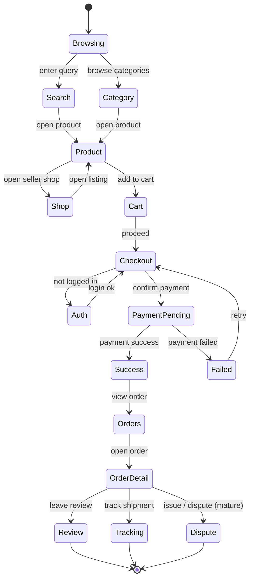
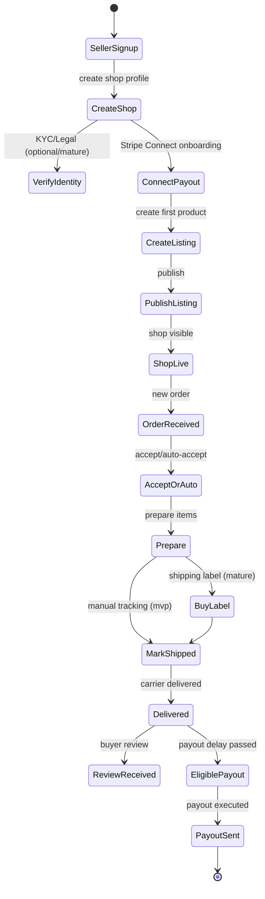
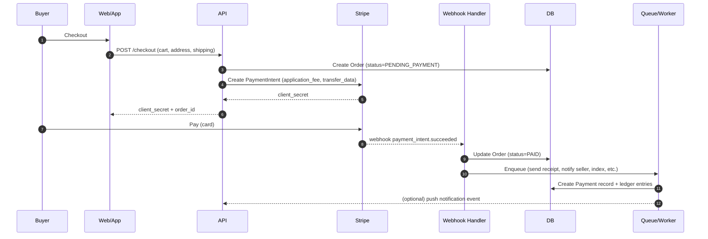

1. Sitemap global (pages & sections)

```mermaid
flowchart TD
   A[ROOT] --> H[Home / Landing]
   A --> EX[Explorer / Search]
   A --> CAT[Category]
   A --> PRD[Product Page]
   A --> SHP[Shop Page]
   A --> CRT[Cart]
   A --> CHK[Checkout]
   A --> ATH[Auth]
   A --> ACC[Buyer Account]
   A --> SEL[Seller Area]
   A --> ADM[Admin]
   A --> LEG[Legal & Help]

H --> H1[Featured Products]
H --> H2[Featured Shops]
H --> H3[Editorial / Collections]
H --> H4[CTA Buy]
H --> H5[CTA Sell]

EX --> EX1[Search Results]
EX --> EX2[Filters]
EX --> EX3[Sort]
EX --> EX4[Collections / Curations]
CAT --> CAT1[Subcategories]
CAT --> EX

SHP --> SHP1[Shop Home]
SHP --> SHP2[Shop Listings]
SHP --> SHP3[Shop Reviews]
SHP --> SHP4[About / Policies]
SHP --> SHP5[Follow Shop]
SHP --> SHP6[Contact / Messages]

PRD --> PRD1[Gallery]
PRD --> PRD2[Variants]
PRD --> PRD3[Description]
PRD --> PRD4[Shipping & Returns]
PRD --> PRD5[Reviews / Q&A]
PRD --> PRD6[Seller Card]
PRD --> PRD7[Related Products]

CRT --> CRT1[Cart Items]
CRT --> CRT2[Shipping Estimate]
CRT --> CRT3[Promo / Gift Card]
CRT --> CHK

CHK --> CHK1[Address]
CHK --> CHK2[Shipping Method]
CHK --> CHK3[Payment]
CHK --> CHK4[Confirm]
CHK --> CHK5[Success / Receipt]

ATH --> ATH1[Sign up]
ATH --> ATH2[Log in]
ATH --> ATH3[Magic link]
ATH --> ATH4[Forgot Password]
ATH --> ATH5[2FA - Mature]

ACC --> ACC1[Profile]
ACC --> ACC2[Orders]
ACC2 --> ACC21[Order Detail]
ACC2 --> ACC22[Track Shipment]
ACC2 --> ACC23[Invoice]
ACC --> ACC3[Addresses]
ACC --> ACC4[Favorites]
ACC --> ACC5[Messages]
ACC --> ACC6[Reviews Given]
ACC --> ACC7[Returns/Disputes - Mature]

SEL --> SEL0[Seller Onboarding]
SEL --> SEL1[Seller Dashboard]
SEL --> SEL2[Shop Settings]
SEL --> SEL3[Products]
SEL3 --> SEL31[List Products]
SEL3 --> SEL32[Create Product]
SEL3 --> SEL33[Edit Product]
SEL3 --> SEL34[Inventory]
SEL --> SEL4[Orders]
SEL4 --> SEL41[Order Detail]
SEL4 --> SEL42[Fulfillment / Shipping]
SEL --> SEL5[Payouts]
SEL --> SEL6[Marketing]
SEL --> SEL7[Analytics - Mature]
SEL --> SEL8[Support / Policies]

ADM --> ADM1[Admin Dashboard]
ADM --> ADM2[Tenants / Marketplaces]
ADM --> ADM3[Shops]
ADM --> ADM4[Users]
ADM --> ADM5[Products / Listings]
ADM --> ADM6[Orders]
ADM --> ADM7[Payments / Fees]
ADM --> ADM8[Moderation / Abuse]
ADM --> ADM9[Disputes - Mature]
ADM --> ADM10[Feature Flags / Config]

LEG --> LEG1[FAQ]
LEG --> LEG2[Shipping Policy]
LEG --> LEG3[Returns Policy]
LEG --> LEG4[Terms / CGV]
LEG --> LEG5[Privacy / RGPD]
LEG --> LEG6[Cookies]
LEG --> LEG7[Contact Support]
```



2. Flow acheteur complet (découverte → achat → post-achat)



3. Flow vendeur complet (onboarding → publier → vendre → expédier → payout)



4. Paiement marketplace (Stripe Connect) + webhooks + états de commande



5. Backoffice Admin + Modération + Litiges (mature)

```mermaid
flowchart TD
   A[Admin Dashboard] --> M[Moderation]
   A --> O[Orders]
   A --> P[Payments & Fees]
   A --> U[Users]
   A --> S[Shops]
   A --> L[Listings/Products]
   A --> T[Tenants/Marketplaces (SaaS)]
   A --> C[Config / Feature Flags]

M --> M1[Reports Queue]
M --> M2[Review Shop]
M --> M3[Review Listing]
M --> M4[Take Action]
M4 --> M41[Remove Listing]
M4 --> M42[Suspend Shop]
M4 --> M43[Ban User]
M4 --> M44[Hold Payout]
M --> M5[Fraud Signals (mature)]

O --> O1[Search Orders]
O --> O2[Order Detail]
O2 --> O21[Refund / Cancel]
O2 --> O22[Force Status]
O2 --> O23[Contact Parties]

P --> P1[Fees]
P --> P2[Payouts]
P --> P3[Refunds]
P --> P4[Chargebacks]
P --> P5[Ledger / Reconciliation (mature)]

C --> C1[Commission Rules]
C --> C2[Shipping Rules (per tenant)]
C --> C3[Category Taxonomy]
C --> C4[Email Templates]
C --> C5[Search Ranking Rules]
```

6. “Services” (worker/async) : emails, search, fraud, payouts, notifications

```mermaid
flowchart LR
   API[API] --> Q[Queue]
   WH[Stripe Webhooks] --> Q
   UI[Admin Actions] --> Q

Q --> E[Email Worker]
Q --> N[Notification Worker]
Q --> SI[Search Index Worker]
Q --> F[Fraud/Risk Worker (mature)]
Q --> PO[Payout Worker]
Q --> R[Reporting Worker (mature)]

E --> SMTP[Email Provider]
N --> PUSH[Push/SMS Provider]
SI --> SEARCH[Meilisearch/Elastic]
PO --> STRIPE[Stripe Transfers/Payouts]
F --> DB[(DB)]
R --> DW[(Analytics/BI store)]
```

7. Multi-tenant SaaS (white-label) : résolution tenant + isolation data

```mermaid
flowchart TD
   R[Request] --> TR[Tenant Resolver]
   TR -->|domain/subdomain/header| TID[tenantId]
   TID --> AUTH[Auth]
   AUTH --> RBAC[RBAC & Policies]
   RBAC --> UC[Use Case]
   UC --> REPO[Repositories (tenant-scoped)]
   REPO --> DB[(Postgres)]
   UC --> EXT[External Services]
   EXT --> STRIPE[Stripe Connect]
   EXT --> S3[S3/R2 Storage]
   EXT --> SEARCH[Search]

DB --> RLS[Optional: Postgres RLS]
RLS --> DB
```
