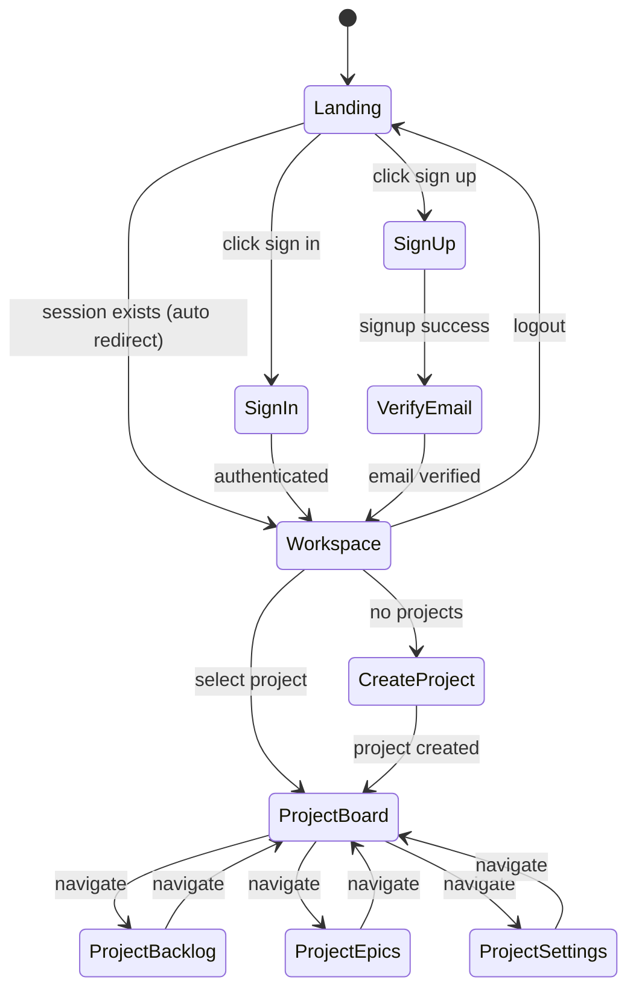
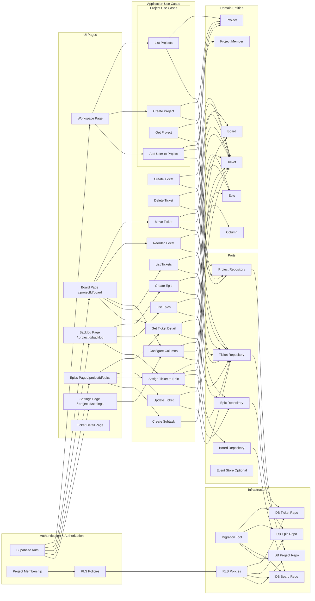
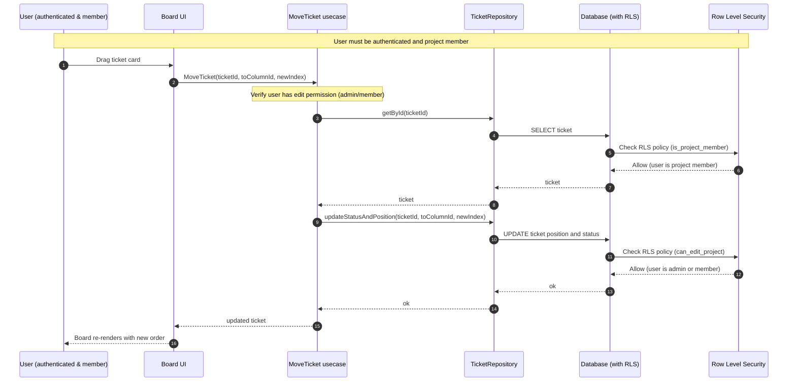

# Architecture Flowcharts

This document contains Mermaid diagrams representing the application architecture, user flows, and system interactions.

## Authentication and Authorization

**Important**: All features require user authentication and project membership:

- **Authentication**: Users must be authenticated via Supabase Auth to access any feature
- **Project Membership**: Users must be members of a project to view or interact with it
- **Permissions**:
  - **View access**: All project members (admin, member, viewer) can view project data
  - **Edit access**: Only users with `admin` or `member` roles can create, update, or delete data
  - **Admin access**: Only users with `admin` role can delete projects or manage project members

See `docs/row-level-security.md` for detailed information about RLS policies and permissions.

## 1. Global Sitemap

```mermaid
flowchart TD
   R[ROOT /] --> L[Landing Page]
   R --> AUTH[Auth Pages]
   AUTH --> SIGNIN[/auth/signin]
   AUTH --> SIGNUP[/auth/signup]
   AUTH --> VERIFY[/auth/verify-email]
   AUTH --> RESET[/auth/reset-password]
   AUTH --> UPDATE[/auth/update-password]
   
   R --> PROTECTED[(auth) Route Group]
   PROTECTED --> WS[/workspace]
   PROTECTED --> PROJ[/:projectId]
   
   PROJ --> BOARD[/:projectId/board]
   PROJ --> BACKLOG[/:projectId/backlog]
   PROJ --> EPICS[/:projectId/epics]
   PROJ --> SETTINGS[/:projectId/settings]
```

**Note**: For detailed user flows and route guard architecture, see `docs/architecture/user-flows.md`.

## 2. Complete End-to-End User Flow



**Note**: For detailed route guard flow and layout responsibilities, see `docs/architecture/user-flows.md`.

**Access Control Notes:**
- All users must be authenticated to access any feature
- Users must be project members to view project data
- Only users with `admin` or `member` roles can create, update, or delete data
- Only users with `admin` role can delete projects or manage project members

## 3. Route & Layout Guard Flow

```mermaid
flowchart TD
   REQ[Request] --> MIDDLEWARE{Middleware<br/>Optional Routing Optimization}
   MIDDLEWARE -->|Public Route| PUBLIC[Public Routes]
   MIDDLEWARE -->|Protected Route| AUTH_LAYOUT[(auth) Layout]
   
   PUBLIC --> LANDING_LAYOUT[Landing Layout<br/>(public) route group]
   LANDING_LAYOUT -->|Session Exists| REDIRECT_WS[Redirect to /workspace]
   LANDING_LAYOUT -->|No Session| LANDING[/ Landing Page]
   PUBLIC --> AUTH_PAGES[/auth/* Auth Pages]
   
   AUTH_LAYOUT -->|No Session| REDIRECT_LANDING[Redirect to /]
   AUTH_LAYOUT -->|Session OK| CHILD{Child Route}
   
   CHILD -->|/workspace| WS_LAYOUT[Workspace Layout]
   CHILD -->|/:projectId| PROJ_LAYOUT[Project Layout]
   
   WS_LAYOUT --> WS_PAGE[Workspace Page<br/>Client: useProjects]
   
   PROJ_LAYOUT -->|getProject = null| REDIRECT_WS[Redirect to /workspace]
   PROJ_LAYOUT -->|getProject OK| PROJ_CHILD{Project Child}
   
   PROJ_CHILD -->|/:projectId| REDIRECT_BOARD[Redirect to /:projectId/board]
   PROJ_CHILD -->|/:projectId/board| BOARD_PAGE[Board Page<br/>Client: useProject(projectId)<br/>useProjectTickets(projectId)]
   PROJ_CHILD -->|/:projectId/backlog| BACKLOG_PAGE[Backlog Page<br/>Client: useProject(projectId)<br/>useProjectTickets(projectId, filters)]
   PROJ_CHILD -->|/:projectId/epics| EPICS_PAGE[Epics Page<br/>Client: useProject(projectId)<br/>useProjectEpics(projectId)]
   PROJ_CHILD -->|/:projectId/settings| SETTINGS_PAGE[Settings Page<br/>Client: useProject(projectId)<br/>useProjectMembers(projectId)]
```

**Security Architecture Notes:**
- **Middleware** is an optimization layer for UX redirects and route filtering. It is NOT the source of truth for security.
- **AuthLayout** and **ProjectLayout** (server components) are the primary security guards, checking authentication and access before rendering.
- **RLS (Row Level Security)** at the database level is the ultimate source of truth for data access control.
- This layered approach ensures security even if middleware is bypassed or misconfigured.

**Note**: For detailed documentation on route structure and layout responsibilities, see `docs/architecture/user-flows.md`.

## 4. Domain and Use Cases (Clean Architecture Map)

This diagram serves as a "build plan": each node represents a building block.



**Security Layer Notes:**
- All UI interactions require authentication (Supabase Auth)
- RLS policies enforce project membership and role-based permissions at database level
- Project membership is checked before any data access
- Edit operations require admin or member role (enforced by RLS)

## 5. Detailed Drag and Drop Flow (Board)



**Security Notes:**
- User must be authenticated (Supabase Auth)
- RLS policies verify user is project member before SELECT
- RLS policies verify user has edit permission (admin/member) before UPDATE
- If user lacks permission, database returns error, usecase handles it
