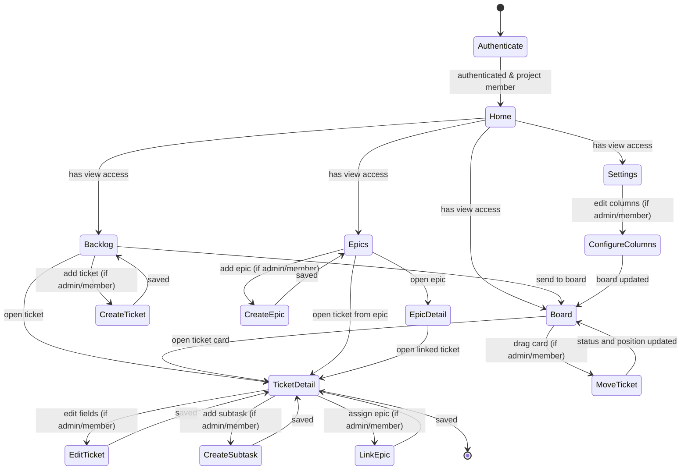
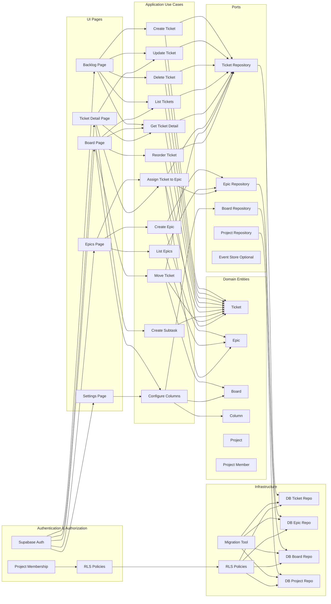
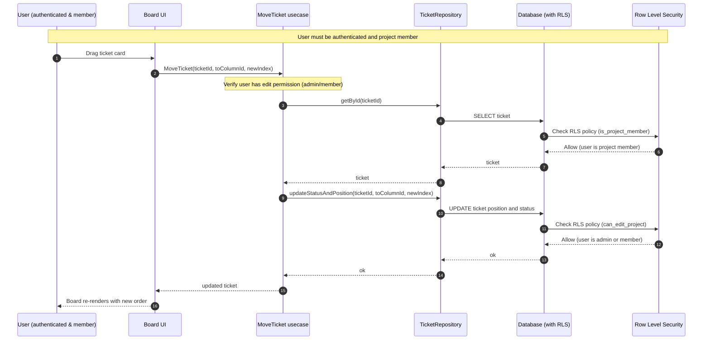

# Architecture Flowcharts

This document contains Mermaid diagrams representing the application architecture, user flows, and system interactions.

## Authentication and Authorization

**Important**: All features require user authentication and project membership:

- **Authentication**: Users must be authenticated via Supabase Auth to access any feature
- **Project Membership**: Users must be members of a project to view or interact with it
- **Permissions**:
  - **View access**: All project members (admin, member, viewer) can view project data
  - **Edit access**: Only users with `admin` or `member` roles can create, update, or delete data
  - **Admin access**: Only users with `admin` role can delete projects or manage project members

See `docs/row-level-security.md` for detailed information about RLS policies and permissions.

## 1. Global Sitemap

```mermaid
flowchart TD
   R[ROOT] --> H[Home Dashboard]
   R --> BL[Backlog]
   R --> BD[Board]
   R --> EP[Epics]
   R --> TK[Ticket Detail]
   R --> SE[Settings]

   H --> H1[Quick Add Ticket]
   H --> H2[My Work]
   H --> H3[Recent Activity]
   H --> H4[Shortcuts]

   BL --> BL1[Ticket List]
   BL --> BL2[Filters and Search]
   BL --> BL3[Sort]
   BL --> BL4[Bulk Actions]
   BL --> BL5[Create Ticket]

   BD --> BD1[Board View]
   BD --> BD2[Columns Config]
   BD --> BD3[Drag and Drop]
   BD --> BD4[Swimlanes Optional]
   BD --> BD5[Board Filters]

   EP --> EP1[Epics List]
   EP --> EP2[Create Epic]
   EP --> EP3[Epic Detail]
   EP3 --> EP31[Epic Tickets]
   EP3 --> EP32[Epic Progress]

   TK --> TK1[Overview]
   TK --> TK2[Edit Fields]
   TK --> TK3[Comments Optional]
   TK --> TK4[Subtasks]
   TK --> TK5[Link to Epic]
   TK --> TK6[History Optional]

   SE --> SE1[Project Settings]
   SE --> SE2[Statuses and Columns]
   SE --> SE3[Priorities]
   SE --> SE4[Labels Optional]
   SE --> SE5[Export and Import]
   SE --> SE6[Theme Optional]
```

## 2. Complete End-to-End User Flow

**Access Control Notes:**
- All users must be authenticated to access any feature
- Users must be project members to view project data
- Only users with `admin` or `member` roles can create, update, or delete data
- Only users with `admin` role can delete projects or manage project members

## 3. Domain and Use Cases (Clean Architecture Map)

This diagram serves as a "build plan": each node represents a building block.

**Security Layer Notes:**
- All UI interactions require authentication (Supabase Auth)
- RLS policies enforce project membership and role-based permissions at database level
- Project membership is checked before any data access
- Edit operations require admin or member role (enforced by RLS)

## 4. Detailed Drag and Drop Flow (Board)

**Security Notes:**
- User must be authenticated (Supabase Auth)
- RLS policies verify user is project member before SELECT
- RLS policies verify user has edit permission (admin/member) before UPDATE
- If user lacks permission, database returns error, usecase handles it
