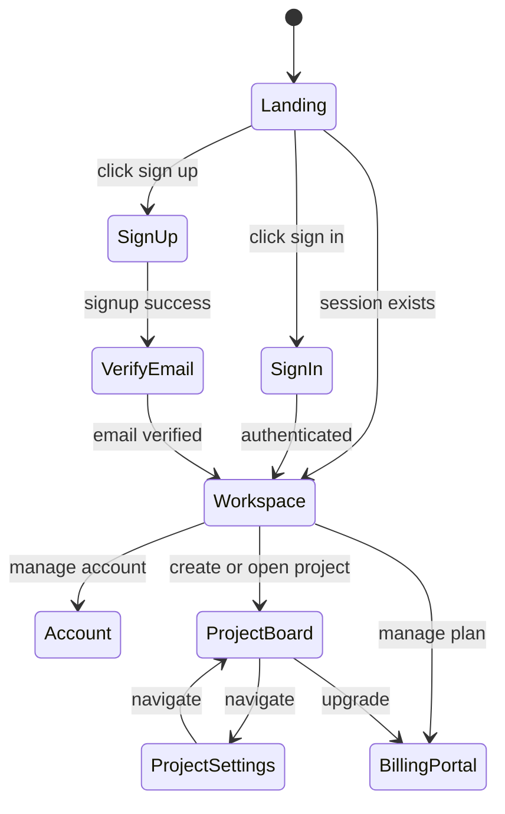
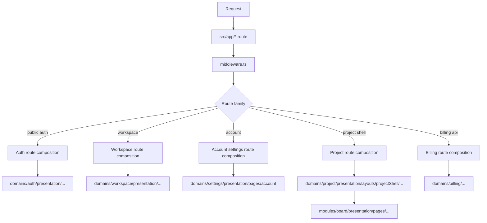
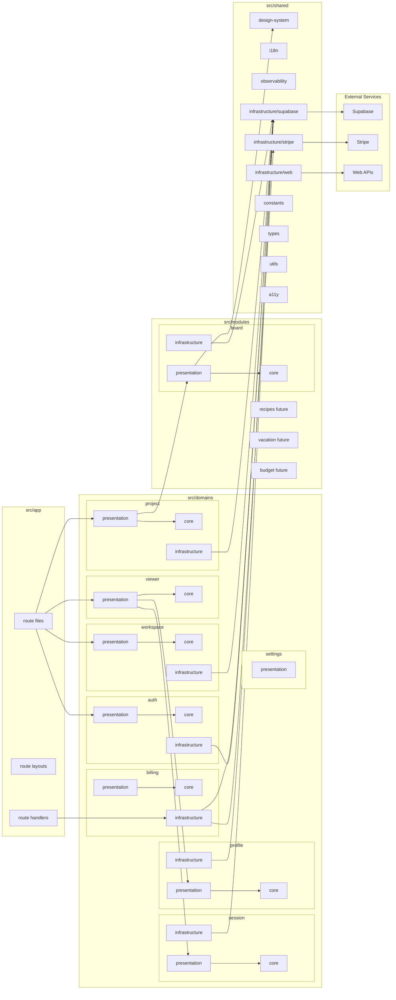

# Architecture Flowcharts

This document contains Mermaid diagrams representing the final routing model and the final domain + module architecture.

## 1. Global Sitemap

```mermaid
flowchart TD
   R[ROOT /] --> LANDING[/]
   R --> AUTH[Auth routes]
   AUTH --> SIGNIN[/auth/signin]
   AUTH --> SIGNUP[/auth/signup]
   AUTH --> VERIFY[/auth/verify-email]
   AUTH --> RESET[/auth/reset-password]
   AUTH --> UPDATE[/auth/update-password]
   AUTH --> CALLBACK[/auth/callback]

   R --> STATIC[Static routes]
   STATIC --> PRICING[/pricing]
   STATIC --> LEGAL[/legal]

   R --> JOIN[/join/:token]
   R --> PROTECTED[(auth) route group]
   PROTECTED --> WS[/workspace]
   PROTECTED --> ACCOUNT[/account]
   PROTECTED --> PROJ[/:projectId]

   PROJ --> BOARD[/:projectId/board]
   PROJ --> EPICS[/:projectId/epics]
   PROJ --> SETTINGS[/:projectId/settings]

   R --> API[API routes]
   API --> CHECKOUT[/api/stripe/checkout]
   API --> PORTAL[/api/stripe/portal]
   API --> WEBHOOK[/api/stripe/webhook]
```

## 2. End-to-End Product Flow

```mermaid
stateDiagram-v2
   [*] --> Landing
   Landing --> SignIn: click sign in
   Landing --> SignUp: click sign up
   Landing --> Workspace: session exists

   SignIn --> Workspace: authenticated
   SignUp --> VerifyEmail: signup success
   VerifyEmail --> Workspace: email verified

   Workspace --> Account: manage account
   Workspace --> ProjectBoard: create or open project
   Workspace --> BillingPortal: manage plan

   ProjectBoard --> ProjectSettings: navigate
   ProjectBoard --> BillingPortal: upgrade
   ProjectSettings --> ProjectBoard: navigate
```

## 3. Route Composition Flow

```mermaid
flowchart TD
   REQ[Request] --> APP[src/app/* route]
   APP --> MIDDLEWARE[middleware.ts]
   MIDDLEWARE --> ROUTE{Route family}

   ROUTE -->|public auth| AUTH_ROUTE[Auth route composition]
   ROUTE -->|workspace| WS_ROUTE[Workspace route composition]
   ROUTE -->|account| ACCOUNT_ROUTE[Account settings route composition]
   ROUTE -->|project shell| PROJECT_ROUTE[Project route composition]
   ROUTE -->|billing api| BILLING_ROUTE[Billing route composition]

   AUTH_ROUTE --> AUTH_PAGE[domains/auth/presentation/...]
   WS_ROUTE --> WS_PAGE[domains/workspace/presentation/...]
   ACCOUNT_ROUTE --> ACCOUNT_PAGE[domains/settings/presentation/pages/account]
   PROJECT_ROUTE --> PROJECT_SHELL[domains/project/presentation/layouts/projectShell/...]
   PROJECT_SHELL --> BOARD_PAGE[modules/board/presentation/pages/...]
   BILLING_ROUTE --> BILLING_FLOW[domains/billing/...]
```

## 4. Final Architecture Map

```mermaid
flowchart LR
   subgraph APP[src/app]
      APP1[route files]
      APP2[route layouts]
      APP3[route handlers]
   end

   subgraph DOMAINS[src/domains]
      subgraph AUTH[auth]
         AUTH_PRE[presentation]
         AUTH_CORE[core]
         AUTH_INFRA[infrastructure]
      end

      subgraph SESSION[session]
         SESSION_PRE[presentation]
         SESSION_CORE[core]
         SESSION_INFRA[infrastructure]
      end

      subgraph PROFILE[profile]
         PROFILE_PRE[presentation]
         PROFILE_CORE[core]
         PROFILE_INFRA[infrastructure]
      end

      subgraph VIEWER[viewer]
         VIEWER_PRE[presentation]
         VIEWER_CORE[core]
      end

      subgraph SETTINGS[settings]
         SETTINGS_PRE[presentation]
      end

      subgraph BILLING[billing]
         BILLING_PRE[presentation]
         BILLING_CORE[core]
         BILLING_INFRA[infrastructure]
      end

      subgraph WORKSPACE[workspace]
         WORKSPACE_PRE[presentation]
         WORKSPACE_CORE[core]
         WORKSPACE_INFRA[infrastructure]
      end

      subgraph PROJECT[project]
         PROJECT_PRE[presentation]
         PROJECT_CORE[core]
         PROJECT_INFRA[infrastructure]
      end
   end

   subgraph MODULES[src/modules]
      subgraph BOARD[board]
         BOARD_PRE[presentation]
         BOARD_CORE[core]
         BOARD_INFRA[infrastructure]
      end

      RECIPES[recipes future]
      VACATION[vacation future]
      BUDGET[budget future]
   end

   subgraph SHARED[src/shared]
      SHARED_1[design-system]
      SHARED_2[i18n]
      SHARED_3[observability]
      SHARED_4[infrastructure/supabase]
      SHARED_5[infrastructure/stripe]
      SHARED_6[infrastructure/web]
      SHARED_7[constants]
      SHARED_8[types]
      SHARED_9[utils]
      SHARED_10[a11y]
   end

   subgraph EXT[External Services]
      EXT1[Supabase]
      EXT2[Stripe]
      EXT3[Web APIs]
   end

   APP1 --> AUTH_PRE
   APP1 --> VIEWER_PRE
   APP1 --> WORKSPACE_PRE
   APP1 --> PROJECT_PRE
   PROJECT_PRE --> BOARD_PRE
   APP3 --> BILLING_INFRA

   AUTH_PRE --> AUTH_CORE
   AUTH_INFRA --> SHARED_4

   SESSION_PRE --> SESSION_CORE
   SESSION_INFRA --> SHARED_4

   PROFILE_PRE --> PROFILE_CORE
   PROFILE_INFRA --> SHARED_4

   VIEWER_PRE --> VIEWER_CORE
   VIEWER_PRE --> SESSION_PRE
   VIEWER_PRE --> PROFILE_PRE

   BILLING_PRE --> BILLING_CORE
   BILLING_INFRA --> SHARED_5
   BILLING_INFRA --> SHARED_4

   WORKSPACE_PRE --> WORKSPACE_CORE
   WORKSPACE_INFRA --> SHARED_4

   PROJECT_PRE --> PROJECT_CORE
   PROJECT_INFRA --> SHARED_4

   BOARD_PRE --> BOARD_CORE
   BOARD_PRE --> SHARED_1
   BOARD_INFRA --> SHARED_4

   SHARED_4 --> EXT1
   SHARED_5 --> EXT2
   SHARED_6 --> EXT3
```

## 5. Data Flow Reference

```mermaid
flowchart TD
   ROUTE[src/app/(auth)/[projectId]/board/page.tsx]
   SHELL[domains/project/presentation/layouts/projectShell/ProjectShell.tsx]
   PAGE[modules/board/presentation/pages/board/index.tsx]
   HOOK[modules/board/presentation/hooks/ticket/useTickets.ts]
   USECASE[modules/board/core/usecases/ticket/listTickets.ts]
   PORT[modules/board/core/ports/ticketRepository.ts]
   REPO[modules/board/infrastructure/supabase/ticket/TicketRepository.supabase.ts]
   CLIENT[shared/infrastructure/supabase/client.ts]
   DB[Supabase]

   ROUTE --> SHELL
   SHELL --> PAGE
   PAGE --> HOOK
   HOOK --> USECASE
   USECASE --> PORT
   PORT --> REPO
   REPO --> CLIENT
   CLIENT --> DB
```

The routing layer composes domain shells and module pages. Session owns current identity state. Profile owns reusable user data. Viewer owns the read-only current-user composition consumed by the wider app. Modules own project-scoped business flows. Infrastructure relies on shared technical clients.
