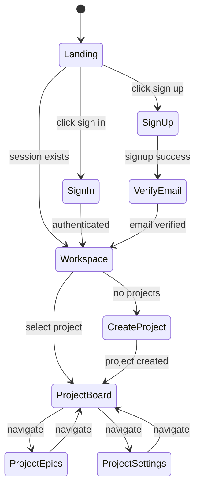
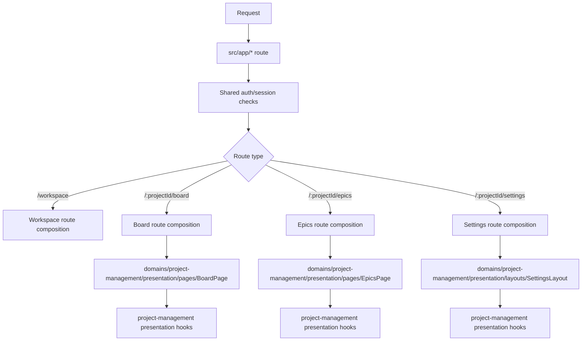
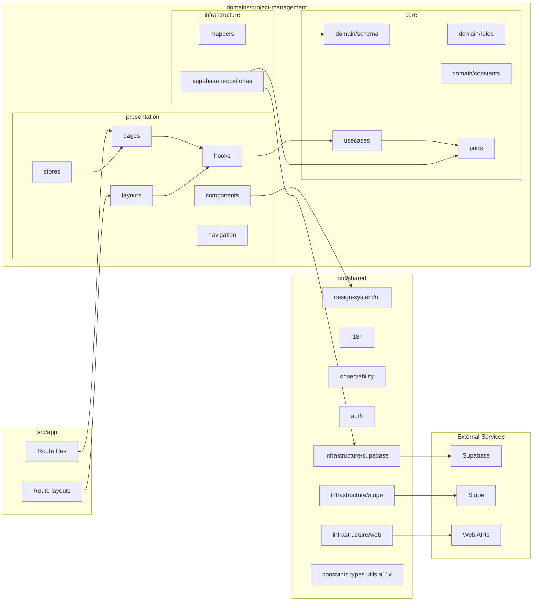

# Architecture Flowcharts

This document contains Mermaid diagrams representing the current routing model and the new modular domain architecture.

## 1. Global Sitemap

```mermaid
flowchart TD
   R[ROOT /] --> L[Landing Page]
   R --> AUTH[Auth Pages]
   AUTH --> SIGNIN[/auth/signin]
   AUTH --> SIGNUP[/auth/signup]
   AUTH --> VERIFY[/auth/verify-email]
   AUTH --> RESET[/auth/reset-password]
   AUTH --> UPDATE[/auth/update-password]

   R --> PROTECTED[(auth) Route Group]
   PROTECTED --> WS[/workspace]
   PROTECTED --> PROJ[/:projectId]

   PROJ --> BOARD[/:projectId/board]
   PROJ --> EPICS[/:projectId/epics]
   PROJ --> SETTINGS[/:projectId/settings]
```

## 2. End-to-End Product Flow

```mermaid
stateDiagram-v2
   [*] --> Landing
   Landing --> SignIn: click sign in
   Landing --> SignUp: click sign up
   Landing --> Workspace: session exists

   SignIn --> Workspace: authenticated
   SignUp --> VerifyEmail: signup success
   VerifyEmail --> Workspace: email verified

   Workspace --> CreateProject: no projects
   Workspace --> ProjectBoard: select project
   CreateProject --> ProjectBoard: project created

   ProjectBoard --> ProjectEpics: navigate
   ProjectBoard --> ProjectSettings: navigate
   ProjectEpics --> ProjectBoard: navigate
   ProjectSettings --> ProjectBoard: navigate
```

## 3. Route Composition Flow

```mermaid
flowchart TD
   REQ[Request] --> APP[src/app/* route]
   APP --> AUTH_GUARDS[Shared auth/session checks]
   AUTH_GUARDS --> ROUTE{Route type}

   ROUTE -->|/workspace| WS_PAGE[Workspace route composition]
   ROUTE -->|/:projectId/board| BOARD_ROUTE[Board route composition]
   ROUTE -->|/:projectId/epics| EPICS_ROUTE[Epics route composition]
   ROUTE -->|/:projectId/settings| SETTINGS_ROUTE[Settings route composition]

   BOARD_ROUTE --> BOARD_PAGE[domains/project-management/presentation/pages/BoardPage]
   EPICS_ROUTE --> EPICS_PAGE[domains/project-management/presentation/pages/EpicsPage]
   SETTINGS_ROUTE --> SETTINGS_LAYOUT[domains/project-management/presentation/layouts/SettingsLayout]

   BOARD_PAGE --> BOARD_HOOKS[project-management presentation hooks]
   EPICS_PAGE --> EPIC_HOOKS[project-management presentation hooks]
   SETTINGS_LAYOUT --> SETTINGS_HOOKS[project-management presentation hooks]
```

## 4. Modular Domain Architecture Map

```mermaid
flowchart LR
   subgraph APP[src/app]
      APP1[Route files]
      APP2[Route layouts]
   end

   subgraph PM[domains/project-management]
      subgraph PM_PRE[presentation]
         PM_PRE_1[pages]
         PM_PRE_2[layouts]
         PM_PRE_3[components]
         PM_PRE_4[hooks]
         PM_PRE_5[stores]
         PM_PRE_6[navigation]
      end

      subgraph PM_CORE[core]
         PM_CORE_1[domain/schema]
         PM_CORE_2[domain/rules]
         PM_CORE_3[domain/constants]
         PM_CORE_4[ports]
         PM_CORE_5[usecases]
      end

      subgraph PM_INFRA[infrastructure]
         PM_INFRA_1[supabase repositories]
         PM_INFRA_2[mappers]
      end
   end

   subgraph SHARED[src/shared]
      SHARED_1[design-system/ui]
      SHARED_2[i18n]
      SHARED_3[observability]
      SHARED_4[auth]
      SHARED_5[infrastructure/supabase]
      SHARED_6[infrastructure/stripe]
      SHARED_7[infrastructure/web]
      SHARED_8[constants types utils a11y]
   end

   subgraph EXT[External Services]
      EXT1[Supabase]
      EXT2[Stripe]
      EXT3[Web APIs]
   end

   APP1 --> PM_PRE_1
   APP2 --> PM_PRE_2
   PM_PRE_1 --> PM_PRE_4
   PM_PRE_2 --> PM_PRE_4
   PM_PRE_3 --> SHARED_1
   PM_PRE_4 --> PM_CORE_5
   PM_PRE_5 --> PM_PRE_1
   PM_CORE_5 --> PM_CORE_4
   PM_INFRA_1 --> SHARED_5
   PM_INFRA_1 --> PM_CORE_4
   PM_INFRA_2 --> PM_CORE_1
   SHARED_5 --> EXT1
   SHARED_6 --> EXT2
   SHARED_7 --> EXT3
```

## 5. Data Flow Reference

```mermaid
flowchart TD
   ROUTE[src/app/[projectId]/board/page.tsx]
   PAGE[domains/project-management/presentation/pages/BoardPage]
   HOOK[domains/project-management/presentation/hooks/useTickets]
   USECASE[domains/project-management/core/usecases/listTickets]
   PORT[domains/project-management/core/ports/ticketRepository]
   REPO[domains/project-management/infrastructure/supabase/ticketRepository.supabase]
   CLIENT[shared/infrastructure/supabase/client-browser]
   DB[Supabase]

   ROUTE --> PAGE
   PAGE --> HOOK
   HOOK --> USECASE
   USECASE --> PORT
   PORT --> REPO
   REPO --> CLIENT
   CLIENT --> DB
```

The routing layer composes domain pages. Domain presentation calls domain use cases. Domain infrastructure relies on shared infrastructure clients.
