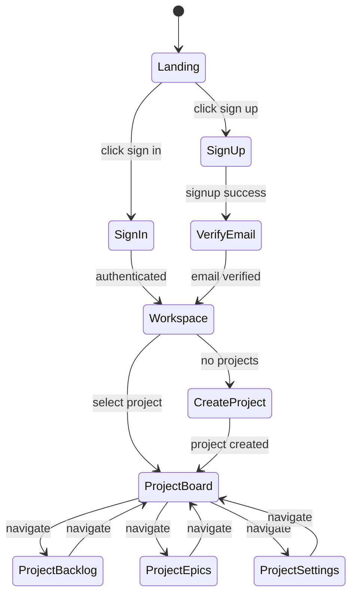

# User Flows Architecture

This document describes the end-to-end user flows and routing architecture of the application.

## End-to-End User Flow



## Route & Layout Guard Flow

The application uses a layered guard system to protect routes and ensure proper authentication and authorization:

```mermaid
flowchart TD
   REQ[Request] --> MIDDLEWARE{Middleware<br/>Optional Routing Optimization}
   MIDDLEWARE -->|Public Route| PUBLIC[Public Routes]
   MIDDLEWARE -->|Protected Route| AUTH_LAYOUT[(auth) Layout]

   PUBLIC --> LANDING_LAYOUT[Landing Layout]
   LANDING_LAYOUT -->|Session Exists| REDIRECT_WS[Redirect to /workspace]
   LANDING_LAYOUT -->|No Session| LANDING[/ Landing Page]
   PUBLIC --> AUTH_PAGES[/auth/* Auth Pages]

   AUTH_LAYOUT -->|No Session| REDIRECT_LANDING[Redirect to /]
   AUTH_LAYOUT -->|Session OK| CHILD{Child Route}

   CHILD -->|/workspace| WS_LAYOUT[Workspace Layout]
   CHILD -->|/:projectId| PROJ_LAYOUT[Project Layout]

   WS_LAYOUT --> WS_PAGE[Workspace Page<br/>Client: useProjects]

   PROJ_LAYOUT -->|getProject = null| REDIRECT_WS[Redirect to /workspace]
   PROJ_LAYOUT -->|getProject OK| PROJ_CHILD{Project Child}

   PROJ_CHILD -->|/:projectId| REDIRECT_BOARD[Redirect to /:projectId/board]
   PROJ_CHILD -->|/:projectId/board| BOARD_PAGE[Board Page<br/>Client: useProject(projectId)<br/>useProjectTickets(projectId)]
   PROJ_CHILD -->|/:projectId/backlog| BACKLOG_PAGE[Backlog Page<br/>Client: useProject(projectId)<br/>useProjectTickets(projectId, filters)]
   PROJ_CHILD -->|/:projectId/epics| EPICS_PAGE[Epics Page<br/>Client: useProject(projectId)<br/>useProjectEpics(projectId)]
   PROJ_CHILD -->|/:projectId/settings| SETTINGS_PAGE[Settings Page<br/>Client: useProject(projectId)<br/>useProjectMembers(projectId)]
```

**Security Architecture:**

- **Middleware** is an optimization layer for UX redirects and route filtering. It is NOT the source of truth for security.
- **AuthLayout** and **ProjectLayout** (server components) are the primary security guards, checking authentication and access before rendering.
- **RLS (Row Level Security)** at the database level is the ultimate source of truth for data access control.
- This layered approach ensures security even if middleware is bypassed or misconfigured.

## Route Structure

### Public Routes

- `/` - Landing page (redirects to `/workspace` if authenticated)
- `/auth/signin` - Sign in page
- `/auth/signup` - Sign up page
- `/auth/verify-email` - Email verification page
- `/auth/reset-password` - Password reset request page
- `/auth/update-password` - Password update page

### Protected Routes (under `(auth)` route group)

- `/workspace` - Workspace page (list projects, create/access projects)
- `/:projectId` - Project root (redirects to `/:projectId/board`)
- `/:projectId/board` - Board view
- `/:projectId/backlog` - Backlog view
- `/:projectId/epics` - Epics view
- `/:projectId/settings` - Project settings

## Layout Responsibilities

### Root Layout (`app/layout.tsx`)

- Provides global providers (ReactQueryProvider, etc.)
- No authentication checks

### Landing Layout (`app/layout.tsx` or page-level check)

- Checks if user is authenticated
- If authenticated → redirect to `/workspace`
- If not authenticated → show landing page

### Auth Layout (`app/(auth)/layout.tsx`)

- Server-side authentication guard
- Uses `getCurrentSession` usecase
- Redirects to `/` on missing session or error (fail-closed)
- Does NOT pass data to children

### Workspace Layout (`app/(auth)/workspace/layout.tsx`)

- Optional shell wrapper
- No data fetching (all data fetched in client page)

### Project Layout (`app/(auth)/[projectId]/layout.tsx`)

- Server-side project access guard
- Uses `getProject` usecase (respects RLS)
- Redirects to `/workspace` if no access (returns null)
- Does NOT pass project data to children

## Data Fetching Strategy

- **Server Layouts**: Only guards, no data fetching
- **Client Pages**: All data fetching via React Query hooks
- **Loading States**: `loading.tsx` files for workspace and project segments

## React Query Hooks Convention

To avoid generic hooks that become unmanageable, project-specific hooks follow a standardized naming pattern:

- `useProject(projectId)` - Fetch project data
- `useProjectTickets(projectId, filters?)` - Fetch tickets for a project
- `useProjectEpics(projectId)` - Fetch epics for a project
- `useProjectMembers(projectId)` - Fetch project members (future)

This convention makes it clear that these hooks are project-scoped and helps prevent generic hooks from growing too large.

## Security Model

1. **Middleware**: Fast cookie-based auth check for protected routes
2. **Layout Guards**: Server-side verification using usecases
3. **RLS Policies**: Database-level access control (source of truth)
4. **Fail-Closed**: Layouts redirect on errors, never render children on failure
