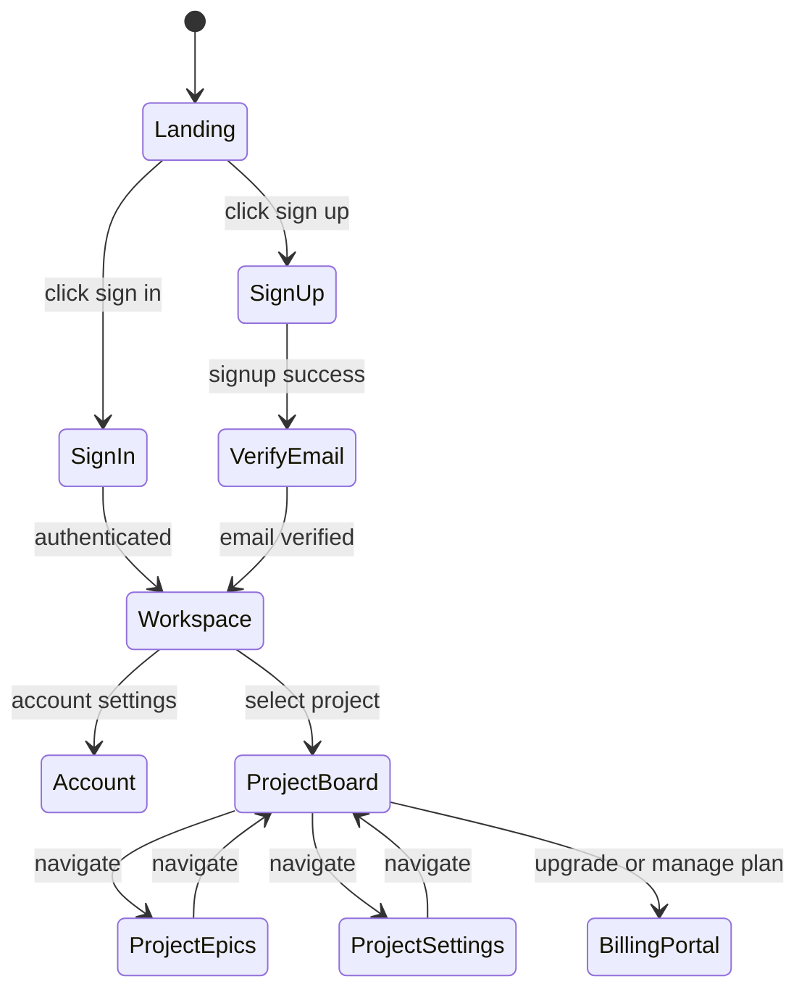

# User Flows Architecture

This document describes routing, guards, and route composition in the final modular architecture.

## Routing Principle

`src/app/` remains the Next.js routing layer only.

Route files should:

- define URL structure
- apply route-level guards
- compose pages, layouts, or flows from the owning domain

## Domain Composition Map

- `src/domains/auth/presentation/` -> auth screens and auth route composition
- `src/domains/workspace/presentation/` -> workspace and account-facing flows
- `src/domains/project-management/presentation/` -> board, epics, project settings
- `src/domains/billing/` -> checkout, portal, plans, subscriptions, billing webhooks

Shared cross-cutting pieces still belong in:

- `src/shared/design-system/`
- `src/shared/infrastructure/`
- `src/shared/i18n/`
- `src/shared/a11y/`
- `src/shared/observability/`

## End-to-End Product Flow

```mermaid
stateDiagram-v2
   [*] --> Landing
   Landing --> SignIn: click sign in
   Landing --> SignUp: click sign up

   SignIn --> Workspace: authenticated
   SignUp --> VerifyEmail: signup success
   VerifyEmail --> Workspace: email verified

   Workspace --> Account: account settings
   Workspace --> ProjectBoard: select project

   ProjectBoard --> ProjectEpics: navigate
   ProjectBoard --> ProjectSettings: navigate
   ProjectBoard --> BillingPortal: upgrade or manage plan
   ProjectEpics --> ProjectBoard: navigate
   ProjectSettings --> ProjectBoard: navigate
```

## Route & Guard Flow

```mermaid
flowchart TD
   REQ[Request] --> APP[src/app route]
   APP --> MIDDLEWARE[middleware.ts]
   MIDDLEWARE --> AUTH_CHECK{Authenticated?}

   AUTH_CHECK -->|No| PUBLIC[Public route handling]
   AUTH_CHECK -->|Yes| PROTECTED[Protected route handling]

   PUBLIC --> AUTH_DOMAIN[auth domain composition]
   PROTECTED --> WS_ROUTE[/workspace composition]
   PROTECTED --> PROJECT_ROUTE[/:projectId/* composition]
   PROTECTED --> BILLING_ROUTE[/api/stripe/* composition]

   WS_ROUTE --> WS_DOMAIN[workspace domain presentation]
   PROJECT_ROUTE --> ACCESS_CHECK{Project access allowed?}
   ACCESS_CHECK -->|No| REDIRECT_WS[Redirect to /workspace]
   ACCESS_CHECK -->|Yes| PM_DOMAIN[project-management presentation]
   BILLING_ROUTE --> BILLING_DOMAIN[billing domain flow]
```

## Route Structure

### Public Routes

- `/`
- `/auth/signin`
- `/auth/signup`
- `/auth/callback`
- `/auth/verify-email`
- `/auth/reset-password`
- `/auth/update-password`
- `/join/[token]`

### Protected Routes

- `/workspace`
- `/account`
- `/:projectId`
- `/:projectId/board`
- `/:projectId/epics`
- `/:projectId/settings`

### Billing/API Routes

- `/api/stripe/checkout`
- `/api/stripe/portal`
- `/api/stripe/webhook`

## Layout Responsibilities

### Root layout

- Global HTML shell
- Shared providers
- No domain business rules

### Auth route handling

- Verifies session presence
- Delegates screen composition to the auth domain

### Workspace route handling

- Delegates user/workspace UI to the workspace domain

### Project route handling

- Verifies project access
- Delegates rendering to `domains/project-management/presentation/pages/` or `layouts/`

### Billing route handling

- Delegates checkout, portal, and webhook orchestration to the billing domain

## Data Fetching Strategy

- `src/app/` route files stay thin
- Domain pages and layouts call domain hooks from `src/domains/<domain>/presentation/hooks/`
- Domain hooks call domain use cases
- Domain repositories and gateways use shared infra clients from `src/shared/infrastructure/`

## Security Model

1. `middleware.ts` can optimize routing and early redirects
2. auth/session concerns are owned by the auth domain and supported by shared infra clients
3. workspace and project-access checks confirm route eligibility
4. database and provider policies remain the final source of truth

## Key Takeaway

Routing stays in `src/app/`, but route-specific rendering is delegated to the owning domain:

- auth routes -> `src/domains/auth/`
- workspace/account routes -> `src/domains/workspace/`
- project routes -> `src/domains/project-management/`
- billing flows -> `src/domains/billing/`
