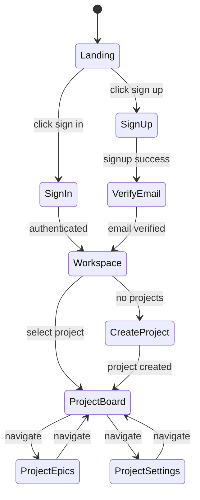

# User Flows Architecture

This document describes routing, guards, and route composition in the modular domain architecture.

## Routing Principle

`src/app/` remains the Next.js routing layer.

Route files should:

- define the URL structure
- apply route-level guards
- compose pages or layouts from domain modules

Domain-specific page logic belongs in:

- `src/domains/project-management/presentation/pages/`
- `src/domains/project-management/presentation/layouts/`

Shared auth/session concerns belong in:

- `src/shared/auth/`
- `src/shared/infrastructure/supabase/`

## End-to-End User Flow

```mermaid
stateDiagram-v2
   [*] --> Landing
   Landing --> SignIn: click sign in
   Landing --> SignUp: click sign up

   SignIn --> Workspace: authenticated
   SignUp --> VerifyEmail: signup success
   VerifyEmail --> Workspace: email verified

   Workspace --> CreateProject: no projects
   Workspace --> ProjectBoard: select project
   CreateProject --> ProjectBoard: project created

   ProjectBoard --> ProjectEpics: navigate
   ProjectBoard --> ProjectSettings: navigate
   ProjectEpics --> ProjectBoard: navigate
   ProjectSettings --> ProjectBoard: navigate
```

## Route & Guard Flow

```mermaid
flowchart TD
   REQ[Request] --> APP[src/app route]
   APP --> MIDDLEWARE[middleware.ts]
   MIDDLEWARE --> AUTH_CHECK{Authenticated?}

   AUTH_CHECK -->|No| PUBLIC[Public route handling]
   AUTH_CHECK -->|Yes| PROTECTED[Protected route handling]

   PUBLIC --> LANDING[Landing or auth routes]
   PROTECTED --> WS_ROUTE[/workspace composition]
   PROTECTED --> PROJECT_ROUTE[/:projectId/* composition]

   PROJECT_ROUTE --> ACCESS_CHECK{Project access allowed?}
   ACCESS_CHECK -->|No| REDIRECT_WS[Redirect to /workspace]
   ACCESS_CHECK -->|Yes| DOMAIN_PAGE[project-management presentation page/layout]
```

## Route Structure

### Public Routes

- `/`
- `/auth/signin`
- `/auth/signup`
- `/auth/verify-email`
- `/auth/reset-password`
- `/auth/update-password`

### Protected Routes

- `/workspace`
- `/:projectId`
- `/:projectId/board`
- `/:projectId/epics`
- `/:projectId/settings`

## Layout Responsibilities

### Root layout

- Global HTML shell
- Shared providers and top-level composition
- No domain business rules

### Auth-related route handling

- Verifies session presence
- Uses shared auth/session utilities
- Redirects early when needed

### Project route handling

- Verifies project access
- Delegates project-specific rendering to `domains/project-management/presentation/pages/` or `layouts/`
- Keeps routing concerns separate from domain UI logic

## Data Fetching Strategy

- `src/app/` route files stay thin
- Domain pages and layouts call domain hooks from `src/domains/project-management/presentation/hooks/`
- Domain hooks call domain use cases
- Domain repositories use shared Supabase clients from `src/shared/infrastructure/supabase/`

## Hook Convention

Hooks are scoped by domain instead of living in one global presentation folder.

Examples:

- `useTickets(projectId)`
- `useCreateTicket()`
- `useEpics(projectId)`
- `useBoard(projectId)`

Location:

- `src/domains/project-management/presentation/hooks/`

## Security Model

1. `middleware.ts` can optimize routing and early redirects
2. shared auth/session utilities confirm authentication state
3. project-access checks confirm route eligibility
4. database policies remain the final source of truth for data access

The key architectural shift is that routing stays in `src/app/`, while project-management UI composition now lives in the domain module rather than a global `src/presentation/` root.
