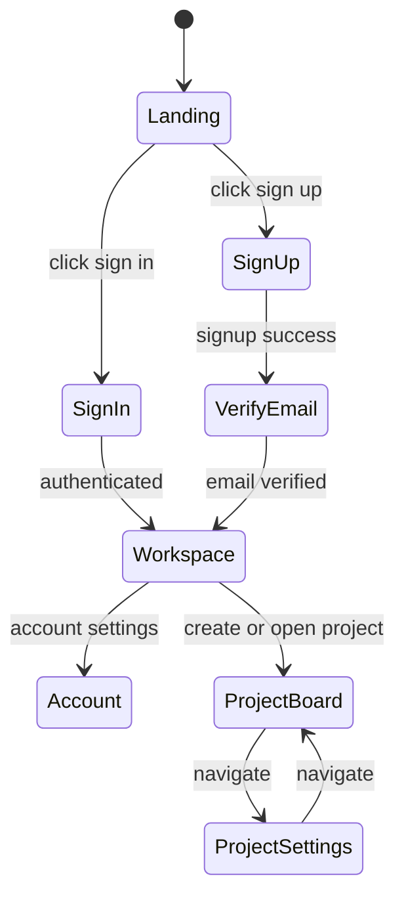

# User Flows Architecture

This document describes routing, guards, and route composition in the final domain + module architecture.

## Routing Principle

`src/app/` remains the Next.js routing layer only.

Route files should:

- define URL structure
- apply route-level guards
- compose pages, layouts, or flows from the owning domain or module

## Ownership Map

- `src/domains/auth/presentation/` -> auth screens and auth action flows
- `src/domains/auth/presentation/hooks/identity/` -> current auth identity state
- `src/domains/profile/presentation/` -> profile editing and reusable current-profile flows
- `src/domains/viewer/presentation/` -> current-user read-model composition
- `src/domains/settings/presentation/` -> account/settings surfaces that compose viewer, profile, and auth
- `src/domains/workspace/presentation/` -> workspace dashboard and create/join project entry UX
- `src/domains/project/presentation/` -> project shell, project settings, members, invitations, enabled-module management
- `src/modules/board/presentation/` -> board and ticket-specific screens

Shared cross-cutting pieces still belong in:

- `src/shared/design-system/`
- `src/shared/infrastructure/`
- `src/shared/i18n/`
- `src/shared/a11y/`

Public/static pages that do not belong to a stable business owner may also live in `src/presentation/pages/`.

This is a documented exception for app-level public surfaces such as landing and legal. See [Accepted Architecture Exceptions](./accepted-exceptions.md).

## End-to-End Product Flow

```mermaid
stateDiagram-v2
   [*] --> Landing
   Landing --> SignIn: click sign in
   Landing --> SignUp: click sign up

   SignIn --> Workspace: authenticated
   SignUp --> VerifyEmail: signup success
   VerifyEmail --> Workspace: email verified

   Workspace --> Account: account settings
   Workspace --> ProjectBoard: create or open project

   ProjectBoard --> ProjectSettings: navigate
   ProjectSettings --> ProjectBoard: navigate
```

## Route & Guard Flow

```mermaid
flowchart TD
   REQ[Request] --> APP[src/app route]
   APP --> MIDDLEWARE[middleware.ts]
   MIDDLEWARE --> AUTH_CHECK{Authenticated?}

   AUTH_CHECK -->|No| PUBLIC[Public route handling]
   AUTH_CHECK -->|Yes| PROTECTED[Protected route handling]

   PUBLIC --> AUTH_DOMAIN[auth route composition]
   PROTECTED --> WORKSPACE_ROUTE[/workspace composition]
   PROTECTED --> ACCOUNT_ROUTE[/account composition]
   PROTECTED --> PROJECT_ROUTE[/:projectId/* composition]
   WORKSPACE_ROUTE --> WORKSPACE_DOMAIN[workspace presentation]
   ACCOUNT_ROUTE --> SETTINGS_DOMAIN[settings presentation]
   PROJECT_ROUTE --> ACCESS_CHECK{Project access allowed?}
   ACCESS_CHECK -->|No| REDIRECT_WS[Redirect to /workspace]
   ACCESS_CHECK -->|Yes| PROJECT_SHELL[project shell]
   PROJECT_SHELL --> MODULE_ROUTE{Active route}
   MODULE_ROUTE --> BOARD_MODULE[board presentation]
   MODULE_ROUTE --> PROJECT_SETTINGS[project settings presentation]
```

## Route Structure

### Public Routes

- `/`
- `/auth/signin`
- `/auth/signup`
- `/auth/callback`
- `/auth/verify-email`
- `/auth/reset-password`
- `/auth/update-password`
- `/join/[token]`

### Protected Routes

- `/workspace`
- `/account`
- `/:projectId`
- `/:projectId/board`
- `/:projectId/settings`

## Layout Responsibilities

### Root layout

- Global HTML shell
- Shared providers
- No business rules

### Auth route handling

- Verifies auth identity presence when needed
- Delegates screen composition to the auth domain

### Workspace route handling

- Delegates list/create/join project UX to the workspace domain
- Imports canonical project contracts from `src/domains/project/` when the flow touches the project entity itself

### Account route handling

- Delegates account settings UI to `src/domains/settings/presentation/pages/account/`.
- That settings surface composes:
  - `viewer` for the current-user read model
  - `profile` for user business data
  - `auth` for current identity, password, and account deletion flows

### Project route handling

- Verifies project access
- Delegates the shell and governance UI to `domains/project/presentation/`
- Delegates project-scoped capability screens to `modules/*/presentation/`

## Data Fetching Strategy

- `src/app/` route files stay thin
- Domain and module pages/layouts call hooks from their own `presentation/hooks/`
- Hooks call use cases
- Repositories and gateways use shared infra clients from `src/shared/infrastructure/`

## Security Model

1. `middleware.ts` can optimize routing and early redirects
2. `auth` owns authentication actions and current auth identity derived from Supabase claims/session
3. current auth identity is the source for auth-derived capabilities
4. `profile` owns user business data
5. `viewer` owns read-only current-user composition for most UI consumption
6. workspace confirms that the user can enter project selection/create/join flows
7. project access checks confirm route eligibility inside a given project
8. database and provider policies remain the final source of truth

## Key Takeaway

Routing stays in `src/app/`, but route-specific rendering is delegated to the correct owner:

- auth routes -> `src/domains/auth/`
- auth identity -> `src/domains/auth/presentation/hooks/identity/`
- profile data -> `src/domains/profile/`
- current-user/viewer composition -> `src/domains/viewer/`
- account/settings surfaces -> `src/domains/settings/`
- workspace routes -> `src/domains/workspace/`
- project container routes -> `src/domains/project/`
- project module routes -> `src/modules/<module>/`

Canonical imports matter as much as route ownership:

- `workspace` keeps catalog/entry flows
- `project` keeps the canonical project schema, repository, and project CRUD use cases
- no `workspace -> project` shim paths should exist in route composition, hooks, tests, or infrastructure
